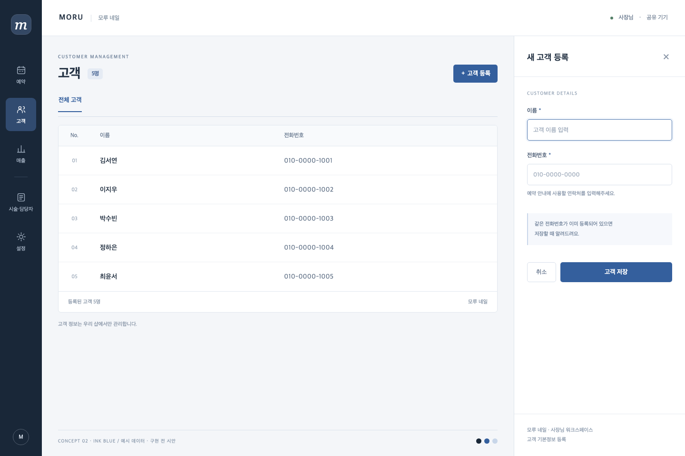
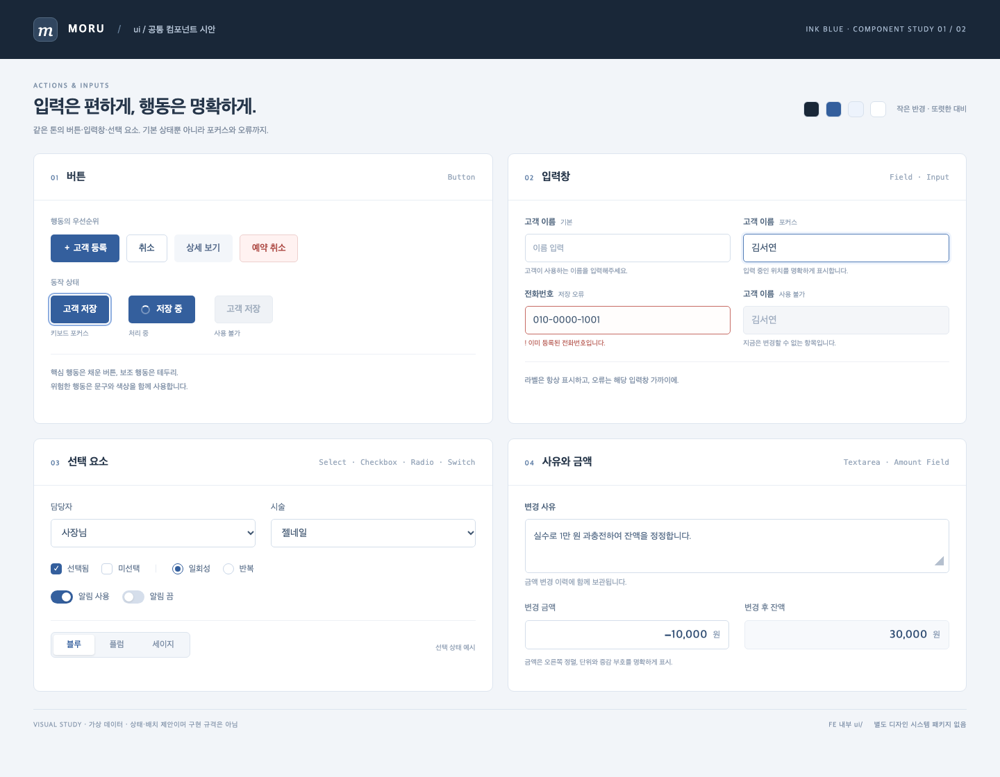
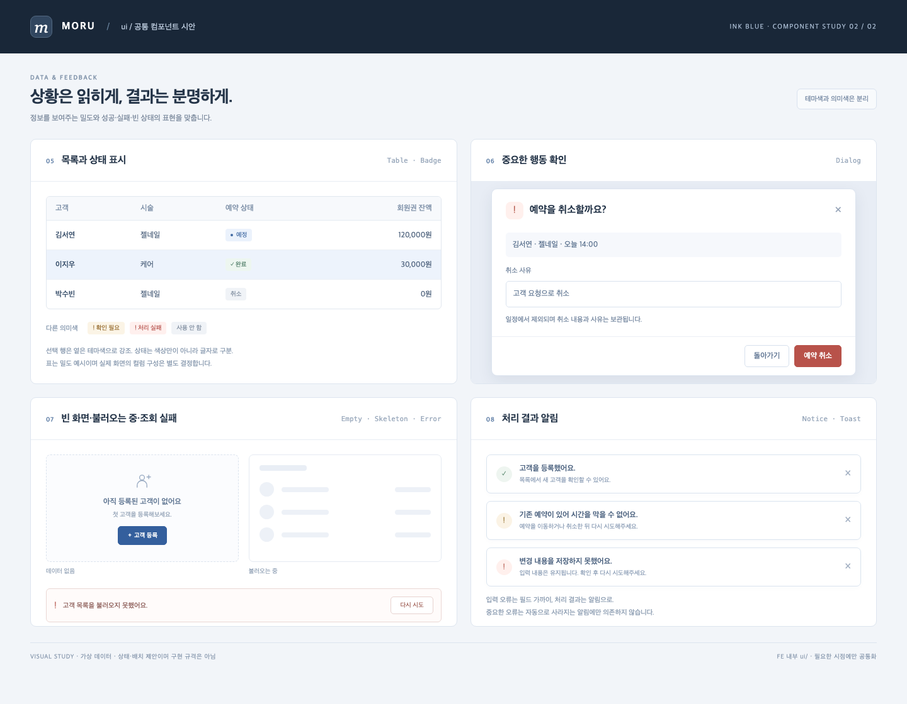

# V1 디자인 기준과 시안

## 새 세션에서 읽을 내용

이 문서는 대화 컨텍스트 없이 선택한 디자인 방향을 확인하기 위한 기준이다.
기능 범위·진행 순서는 [V1 범위](../stories/v1-scope.md)와 [스토리 목록](../stories/index.md)을 함께 읽는다.
UI 작업을 시작할 때 이 문서와 선택한 시안 이미지를 실제로 열어 확인한다. 파일이 존재하는 것만으로 모델이 이미지를 자동 인지하는 것은 아니다.

## 합의한 방향

- 전체 화면은 **② 잉크 블루**를 기본 방향으로 삼는다. 좁은 메뉴 레일·밀도 높은 목록·명확한 작업 영역이 기준이다.
- 선택 이유: 짙은 메뉴·선택 상태·주요 버튼의 대비가 뚜렷해 테마별 시각적 차이가 잘 드러난다. 블루 색상을 고정한다는 뜻은 아니다.
- 공통 UI는 아래 입력·피드백 시안을 출발점으로 한다. 세부 색상·간격·크기·상호작용은 실제 구현 시 사용자 리뷰로 조정한다.
- 별도 디자인 시스템 제품·패키지·관리 화면을 만들지 않는다. 공통 컴포넌트는 FE 레포 내부 `ui/`에 필요한 시점에만 둔다. 구체 경로·프로젝트 구성은 사용자 담당이다.
- 테마는 시각적 표현을 바꾸며 기능·배치는 유지한다. 오류·경고·성공의 의미와 가독성은 테마와 별도로 유지한다.
- AI는 디자인·FE 구현, 사용자는 구조·방식·디자인 리뷰와 BE 직접 구현을 담당한다. 이 시안 선택은 스토리 구현 승인을 대체하지 않는다.

## 이미지 목록

| 파일 | 상태 | 용도 |
| --- | --- | --- |
| [01-warm-plum.png](images/01-warm-plum.png) | 비교안 / 미선택 | 웜 플럼, 사이드바와 카드형 등록 패널 |
| [02-ink-blue.png](images/02-ink-blue.png) | **선택한 기본 방향** | 좁은 메뉴 레일, 밀도 높은 목록, 우측 등록 영역 |
| [03-soft-sage.png](images/03-soft-sage.png) | 비교안 / 미선택 | 상단 메뉴, 가로형 등록 영역 |
| [ui-01-inputs.png](images/ui-01-inputs.png) | 공통 UI 출발점 / 상세 보류 | 버튼·입력·선택·사유·금액과 각 상태 |
| [ui-02-feedback.png](images/ui-02-feedback.png) | 공통 UI 출발점 / 상세 보류 | 목록·배지·확인창·알림·빈 상태·로딩·오류 |

### 선택한 전체 화면

### 공통 UI — 입력·조작

### 공통 UI — 표시·피드백

## 해석할 때 주의할 점

- 이미지의 MORU·모루 네일, 고객·연락처·금액은 가상 예시다. 실제 브랜드·고객 데이터가 아니다.
- 시안의 메뉴·표 컬럼·문구·배지는 기능 범위나 저장 모델을 추가 승인한 것이 아니다. 구현 범위는 해당 스토리를 따른다.
- 우측 패널을 모든 화면에 강제하지 않는다. 실제 고객·예약·회원권 흐름에 맞춰 사용자와 확인한다.
- 선택 요소나 테이블 시안이 관련 라이브러리 설치 승인을 뜻하지 않는다. Zustand·TanStack Table·Form은 필요 시 사용자가 직접 설치한다.
- 이미지 자체는 반응형·키보드 조작·접근성·동작 검증 결과가 아니다. 실제 구현에서 확인한다.
- 전용 컴포넌트 카탈로그나 모든 UI의 선구현은 범위에 넣지 않는다.

## 다음 단계와 검증

사용자 프로젝트 구성 후, 첫 승인된 스토리에서 선택한 방향을 적용하고 화면·코드를 리뷰한다.
세부 디자인 합의를 위해 지금 추가 기획을 이어갈 필요는 없다.

보관 확인: `git status --short -- .harness/design`
이미지 원본은 레포 내부에 복사했으며 임시 폴더에 의존하지 않는다. Git 이력·다른 기기까지 보존하려면 별도 커밋·전달이 필요하다.
